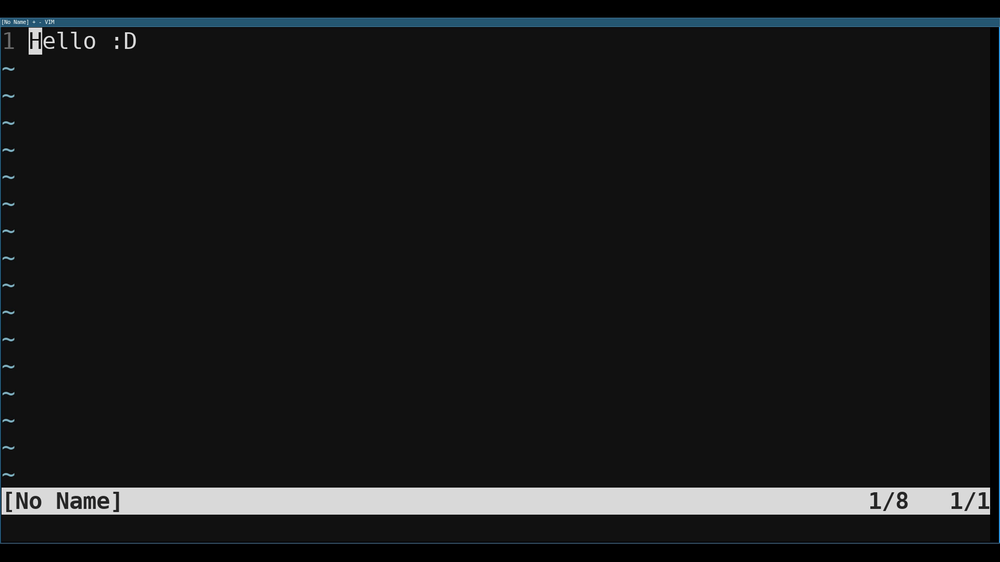

### Various Vim Encoders

----

*Various Vim Encoders* is a small Vim plugin which adds encoding capabilities to the Vim editor.
It configures key mappings for the most commonly used encoding schemes and enables you to transform
text without leaving your editor. Some of its features include:

* Base64 encoding/decoding
* HTML encoding/decoding
* URL encoding/decoding
* HEX encoding/decoding
* Binary encoding/decoding
* [...]

The current version of *vve* does also support some features which are not really encoding related.
These features have proven to be useful, but may be removed in future versions. Some of these
features include:

* Number conversion
* In place arithmetic
* Endian Swapper
* Length Calculation
* [...]




### Installation 

----

*vve* is structured according to Vim's plugin specifications and can be consumed by Vim's native
package manager as well as by several other tools like *Vundle* or *Pathogen*. 

If you use Vim's native package manager, just clone the repository in either the ``start`` or ``opt``
folder of your Vim configuration folder. E.g.:

```
cd ~/.vim/pack/plugins/start/
git clone https://github.com/qtc-de/vve
```

If you have chosen the ``start`` folder, *vve* will be available on each startup of Vim. If you decided
to use the ``opt`` folder, you have to call ``:packadd vve`` from within Vim to enable it. 

If you use an external package manager please read the corresponding manual on how to add additional
plugins.


### Usage

-----

*vve* makes extensive usage of Vim's Python3 integration and uses VimL functions as wrappers around the
actual python code. However, interfacing with the functions directly should not be required and only the
key mappings are of interest in this description.

*vve* defines key mappings with identical functionality for normal and visual mode. While the visual mode
mappings operate on the data that has been selected, the normal mode mappings switch to operator pending
mode and expect a motion to define the area of effect. The following mappings are currently defined (notice
that each key combination needs to be prefixed by your \<leader\> key):

**Encoding Related Mappings**

| Key       |Description                                                  |
|:---------:|-------------------------------------------------------------|
| eb        |Encode as binary                                                |
| eB        |Encode as base64                                                |
| ee        |Encode HTML special characters (entities)                    |
| eE        |Encode all characters as HTML (entities)                     |
| eh        |Encode as hex                                                   |
| eH        |Encode as hex string                                            |
| eu        |Encode URL special characters                                |
| eU        |Encode all characters as URL                                 |
| ex        |Encode XML special characters                                |
| eX        |Currently the same as ex                                     |
| db        |Decode binary                                                |
| dB        |Decode base64                                                |
| dh        |Decode hex                                                   |
| dH        |Decode hex string                                            |
| du        |Decode URL                                                   |
| dU        |Currently same as du                                         |
| de        |Decode HTML                                                  |
| dE        |Currently same as de                                         |
| dx        |Decode XML                                                   |
| dX        |Currently same as dx                                         |


**Number Related Mappings**

| Key       |Description                                                  |
|:---------:|-------------------------------------------------------------|
| th        |To hex format                                                |
| tH        |To hex string format                                         |
| tb        |To binary format                                             |
| to        |To octal format                                              |
| td        |To decimal format                                            |
| ma        |In place addition                                            |
| ms        |In place subtraction                                         |
| mm        |In place multiplication                                      |
| md        |In place division                                            |


**String Related Mappings**

| Key       |Description                                                  |
|:---------:|-------------------------------------------------------------|
| se        |Swap endianess of hex strings                                |
| sc        |Echo string length                                           |
| sC        |Echo hex string length                                       |
| su        |Convert to upper                                             |
| sl        |Convert to lower                                             |
| fc        |Convert to camelCase (from snake_case)                       |
| fs        |Convert to snake_case (from camelCase)                       |
| fs        |Convert to markdown anchor                                   |


### Limitations

----

Decoding arbitrary portions of text inside of an editor has of course certain limitations.
If the decoded result contains non UTF-8 conform character codes, the decoding operation
might fail. Currently, this behavior is totally expected, but we may implement workarounds
in future.


*Copyright 2020, Tobias Neitzel and the vve contributors.*
